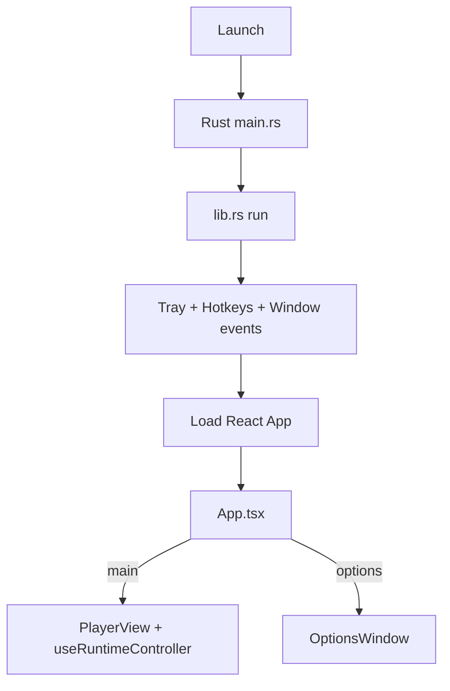
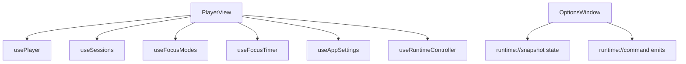
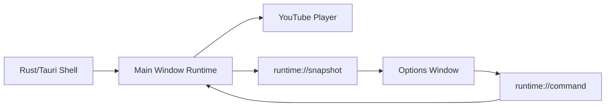
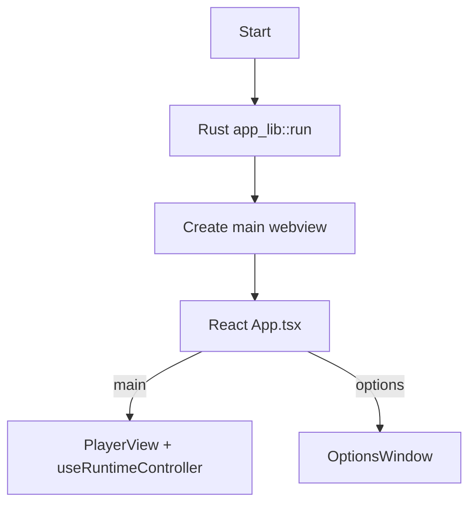
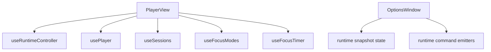
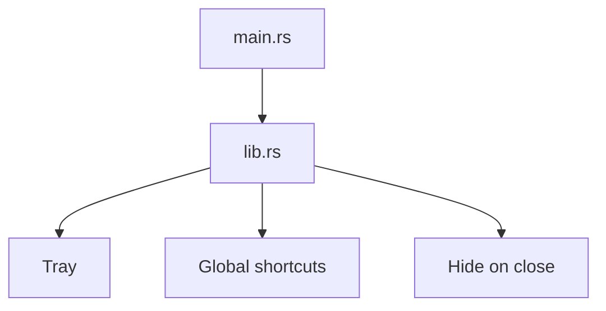
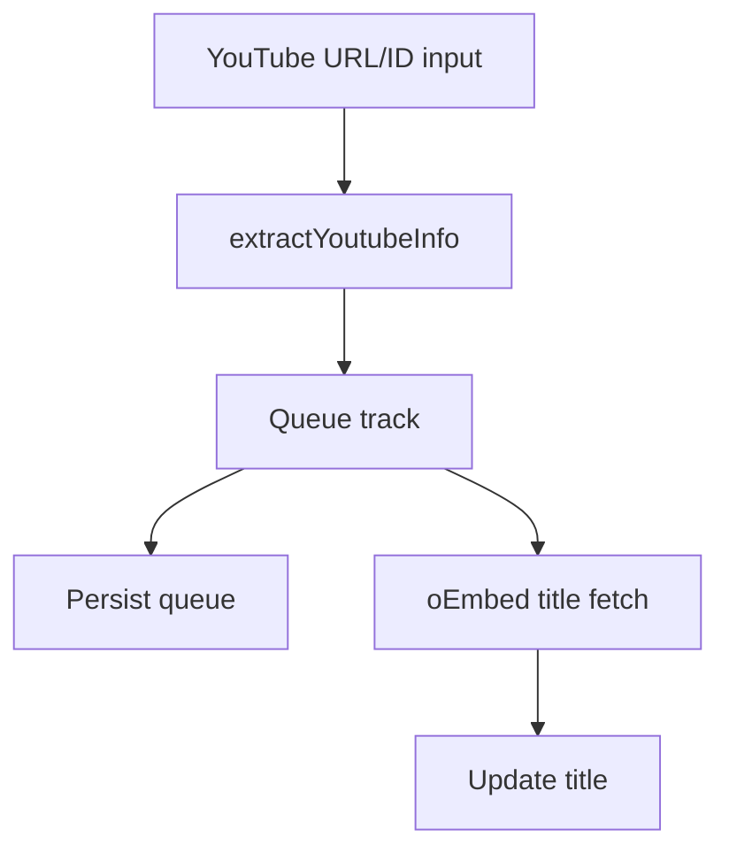

# Architecture Audit: TaurusMusicPlayer (Updated 2026-06-01)

## 1. Project Overview

TaurusMusicPlayer is a compact desktop music player for productivity workflows (coding/study) built with React + Tauri + Rust. Playback is driven by YouTube embeds in the frontend, while Rust provides desktop shell capabilities (tray, global shortcuts, window lifecycle).

- Purpose:
  - Play and control YouTube tracks
  - Manage queue, sessions, focus timer, focus modes, blacklist, settings
  - Use tray and global shortcuts for background control
- Stack:
  - Frontend: React 19, TypeScript, Vite
  - Desktop shell/backend: Tauri v2 (Rust)
- Runtime model:
  - Main window: player runtime owner
  - Options window: controller/view over runtime snapshots
  - Rust: tray/hotkeys/hide-to-tray

## 2. Repository Structure

| Path | Responsibility | Notes |
| ---- | -------------- | ----- |
| `src/main.tsx` | React bootstrap | wraps `App` in `ErrorBoundary` |
| `src/App.tsx` | Window role switcher | `?window=options` => `OptionsWindow`, else `PlayerView` |
| `src/features/player/usePlayer.ts` | Playback + queue state machine | YouTube player integration, polling, hotkey listeners |
| `src/features/player/PlayerView.tsx` | Main UI composition | wires hooks + invokes runtime controller |
| `src/runtime/useRuntimeController.ts` | Runtime orchestration hub | handles runtime commands, snapshots, legacy compat |
| `src/runtime/RuntimeSnapshot.ts` | Runtime snapshot model | shared snapshot structure sent to options |
| `src/runtime/RuntimeEvents.ts` | Runtime event names | `runtime://request-snapshot`, `runtime://snapshot`, `runtime://command` |
| `src/ipc/events.ts` | Central event constants | `player://...`, `global-shortcut://...`, `runtime://...` |
| `src/ipc/player.contract.ts` | Typed IPC contract | payload map, typed emit/listen helpers, `RuntimeCommand` |
| `src/features/settings/OptionsWindow.tsx` | Options controller/view | subscribes snapshot + emits runtime commands |
| `src/features/sessions/*` | Session persistence/UI | localStorage templates + CRUD |
| `src/features/focus-timer/*` | Focus timer logic/UI | timer state machine + controls |
| `src/features/focus-modes/*` | Focus mode logic/UI | mode config + selection behavior |
| `src/features/settings/useAppSettings.ts` | Persisted app settings | import/export/reset and playback settings |
| `src-tauri/src/lib.rs` | Rust app runtime | tray menu/events, global shortcuts, hide-on-close |
| `src-tauri/capabilities/default.json` | Tauri ACL | event/window/webview permissions for `main`,`options` |
| `docs/runtime-state-architecture.md` | Runtime ownership design doc | migration status + controller responsibilities |

## 3. Startup Flow

1. Rust process starts (`src-tauri/src/main.rs` -> `app_lib::run()`).
2. Tauri builder registers:
   - global shortcuts
   - log plugin
   - tray icon/menu
   - hide-on-close handler
3. Frontend loads and `App.tsx` selects window mode.
4. Main window (`PlayerView`) initializes hooks + runtime controller.
5. Options window requests runtime snapshot and renders from received state.



## 4. Frontend Architecture

- `PlayerView` is now mostly UI + hook composition:
  - `usePlayer`
  - `useSessions`
  - `useFocusModes`
  - `useFocusTimer`
  - `useAppSettings`
  - `useRuntimeController`
- `useRuntimeController` is the command/snapshot orchestration layer.
- `OptionsWindow` no longer runs independent runtime hooks for sessions/modes/timer; it renders from runtime snapshots and emits typed commands.



## 5. Tauri Bridge / IPC

No `#[tauri::command]` invoke commands currently. IPC is event-based.

### Event map (current)

| Event | Producer | Consumer | Payload |
| ----- | -------- | -------- | ------- |
| `runtime://request-snapshot` | Options window | Main runtime controller | `void` |
| `runtime://snapshot` | Main runtime controller | Options window | `RuntimeSnapshot` |
| `runtime://command` | Options window | Main runtime controller | `RuntimeCommand` union |
| `player://state` (legacy compat) | Main runtime controller | Legacy options flows | `{ queue, currentIndex }` |
| `player://play-index` (legacy compat) | Legacy emitters | Main runtime controller | `{ index }` |
| `player://remove-track` (legacy compat) | Legacy emitters | Main runtime controller | `{ id }` |
| `player://clear-queue` (legacy compat) | Legacy emitters | Main runtime controller | `void` |
| `player://dedup-queue` (legacy compat) | Legacy emitters | Main runtime controller | `void` |
| `player://start-session` (legacy compat) | Legacy emitters | Main runtime controller | `{ sessionId }` |
| `player://request-state` (legacy compat) | Legacy emitters | Main runtime controller | `void` |
| `global-shortcut://play-pause` | Rust | `usePlayer` | `void` |
| `global-shortcut://next-track` | Rust | `usePlayer` | `void` |
| `global-shortcut://previous-track` | Rust | `usePlayer` | `void` |
| `global-shortcut://toggle-mute` | Rust | `usePlayer` | `void` |

## 6. Rust Backend Architecture

Rust stays shell-focused and unchanged by runtime refactors:

- Global shortcuts registration:
  - `Ctrl+Alt+P` play/pause
  - `Ctrl+Alt+N` next
  - `Ctrl+Alt+B` previous
  - `Ctrl+Alt+M` mute
- Tray menu:
  - show/hide, play/pause, next, previous, quit
- Window close event prevents app exit and hides window to tray.

No native Rust audio engine or media library scanning is present.

## 7. Playback Workflow

1. Input URL/ID parsed by `extractYoutubeInfo`.
2. Queue updated in `usePlayer`.
3. Hidden `react-youtube` player loads/cues video.
4. `usePlayer` polls current time/duration.
5. Ended track triggers `nextTrack` when autoplay is enabled.

## 8. Library/File Workflow

Current app is YouTube-link-based, not filesystem-library-based.

- Discovery/scanning local files: **Unknown from current source** (not implemented)
- Metadata:
  - duration/current from YouTube JS API
  - title enrichment via YouTube oEmbed fetch

## 9. Data Model

Primary models in `src/types/player.ts`:
- `Track`
- `Session`
- `FocusMode`
- `PlayerState` (conceptual TS shape)

Runtime snapshot model:
- `RuntimeSnapshot` in `src/runtime/RuntimeSnapshot.ts`

Runtime command model:
- `RuntimeCommand` union in `src/ipc/player.contract.ts`

## 10. State Synchronization (Current)

Single runtime source of truth:
- Main window runtime hooks + `useRuntimeController`.

Sync path:
- Options -> `runtime://command` -> Main runtime actions
- Main -> `runtime://snapshot` -> Options render state

Legacy compatibility:
- `player://...` listeners still active inside runtime controller.

## 11. Build/Dev/Release

- `npm run build`
- `npm run tauri -- dev`
- `npm run tauri -- build`
- `cargo check` (inside `src-tauri`)

## 12. Strengths

1. Runtime ownership is now explicit and centralized.
2. Typed IPC contract exists (`events.ts` + `player.contract.ts`).
3. Options window no longer owns duplicate playback runtime state.
4. Rust shell responsibilities are cleanly separated from playback logic.

## 13. Risks / Technical Debt

| Issue | Impact | Evidence | Recommended Fix | Priority |
| ----- | ------ | -------- | --------------- | -------- |
| `useAppSettings` still mounted in both windows | Potential dual-writer config drift | `PlayerView.tsx`, `OptionsWindow.tsx` both call `useAppSettings` | Introduce single settings authority + sync protocol | Medium |
| Legacy `player://...` path still active | Extra maintenance surface, mixed protocols | `useRuntimeController.ts` legacy handlers | Retire once callers fully migrated | Medium |
| Runtime command switch can grow large | Harder maintainability | `useRuntimeController.ts` command switch | Split by domain handlers (`queue`, `session`, `focus`) | Medium |
| UI text glyph encoding corruption in `PlayerView.tsx` | Visual quality / readability issue | Titlebar/control glyphs show mojibake chars in source | Normalize file encoding to UTF-8 and restore glyph chars | Low |
| CSP remains `null` | Reduced webview hardening | `src-tauri/tauri.conf.json` | Define strict CSP compatible with embed needs | Medium |

## 14. Feature Development Guide (Current Architecture)

1. Add new runtime behavior:
   - extend `RuntimeCommand` in `player.contract.ts`
   - handle in `useRuntimeController.ts`
   - emit from options/main as needed
2. Add new runtime snapshot field:
   - update `RuntimeSnapshot.ts`
   - fill in `buildSnapshot()` in `useRuntimeController.ts`
   - consume in `OptionsWindow.tsx`
3. Keep `PlayerView.tsx` focused on UI composition and hook wiring.

## 15. Debugging Guide

- Runtime command issues:
  - inspect `useRuntimeController.ts` subscriptions and switch handling
- Snapshot sync issues:
  - verify `runtime://request-snapshot` and `runtime://snapshot` flow
- Shortcut issues:
  - verify Rust emits (`lib.rs`) and `usePlayer` listeners
- Permission issues:
  - verify `src-tauri/capabilities/default.json` event/window/webview allowances

## 16. AI Agent Notes

Start here:
1. `src/runtime/useRuntimeController.ts`
2. `src/features/player/usePlayer.ts`
3. `src/features/settings/OptionsWindow.tsx`
4. `src/ipc/player.contract.ts`

Do not casually change:
- event names/constants in `src/ipc/events.ts`
- runtime command payload shapes
- window labels (`main`, `options`)

## 17. Mermaid Diagrams

### Overall architecture


### Startup flow


### Frontend module relationships


### Rust backend


### Playback sequence
```mermaid
sequenceDiagram
  participant User
  participant Main as Main Runtime/usePlayer
  participant YT as YouTube API
  participant Opt as Options Window
  User->>Main: Add/Load URL
  Main->>YT: load/cue video
  YT-->>Main: state/time events
  Main-->>Opt: runtime://snapshot
  Opt->>Main: runtime://command
```

### Library workflow


## 18. Accuracy Notes

- This update reflects current runtime-controller architecture in source.
- No Rust command-invoke API is assumed (event-driven IPC only).
- Local filesystem media library claims remain `Unknown from current source`.

