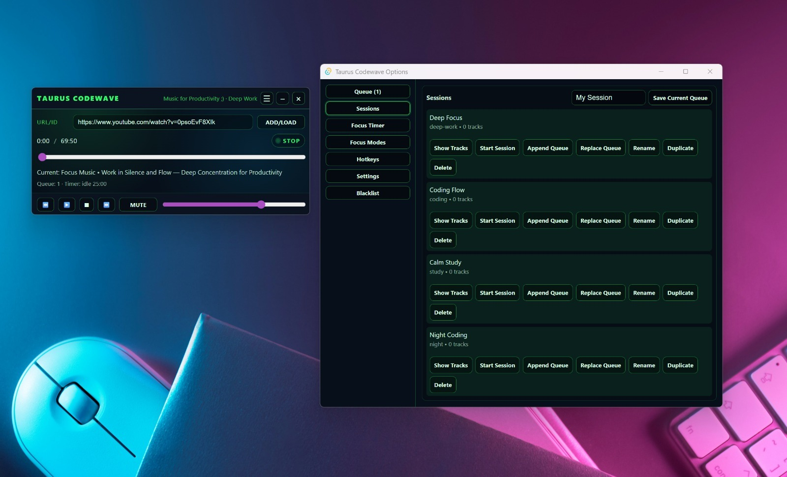

# Taurus Music Player

Taurus Music Player is a compact Tauri v2 desktop player for coding and study. It uses a React/Vite frontend, a Rust backend, and `mpv` + `yt-dlp` for low-memory YouTube audio-only playback in the desktop app.



## Current project

- React 19, TypeScript, Vite, and `react-youtube`
- Tauri v2 desktop shell and Rust 2021 backend
- Audio-only desktop playback through `mpv` and `yt-dlp`
- Browser-only Vite fallback through the YouTube embed player
- Queue, sessions/playlists, focus timer, focus modes, blacklist, and local settings
- System tray controls, hide-to-tray behavior, and global shortcuts

### Desktop shortcuts

- `Ctrl+Alt+P` - Play/Pause
- `Ctrl+Alt+N` - Next track
- `Ctrl+Alt+B` - Previous track
- `Ctrl+Alt+M` - Mute/Unmute

## Prerequisites

| Tool | Purpose | Check command |
| --- | --- | --- |
| Node.js | Frontend/tooling; current LTS recommended | `node --version` |
| npm | Installed with Node.js | `npm --version` |
| Rust | Rust 1.77.2+ compatible stable toolchain | `rustc --version` |
| MSVC Build Tools | Tauri Windows builds | Install Visual Studio Build Tools with **Desktop development with C++** |
| WebView2 Runtime | Tauri Windows runtime | Usually installed on Windows 10/11 |
| mpv | Audio-only desktop playback | `mpv --version` |
| yt-dlp | YouTube audio resolution | `yt-dlp --version` |

Install the Rust formatter once if it is missing:

```powershell
rustup component add rustfmt
```

### mpv and yt-dlp locations

The app first searches `PATH`, then also checks these Windows locations:

```text
mpv
mpv.exe
C:\Program Files\MPV Player\mpv.exe

yt-dlp
yt-dlp.exe
C:\Users\Thiago\AppData\Local\Microsoft\WinGet\Links\yt-dlp.exe
C:\Tools\yt-dlp\yt-dlp.exe
C:\Program Files\yt-dlp\yt-dlp.exe
```

`mpv` and `yt-dlp` are required for Tauri audio-only playback. Browser-only Vite development uses the YouTube embed fallback and does not require them.

## First-time setup

Run from the repository root:

```powershell
npm ci

Push-Location src-tauri
cargo check
Pop-Location
```

Use `npm install` only when you intentionally changed JavaScript dependencies and need to update `package-lock.json`.

## Development

### Frontend only

Starts Vite at `http://localhost:5173`. Use this for React/UI work. Tauri-only features, such as the tray, native window controls, global shortcuts, and mpv playback, are unavailable in this mode.

```powershell
npm run dev
```

Build and preview the frontend production bundle:

```powershell
npm run build
npm run preview
```

### Full desktop app

Starts Vite and launches the Tauri application with the Rust backend, system tray, global shortcuts, and mpv audio-only playback.

```powershell
npm run tauri -- dev
```

Equivalent command:

```powershell
npx tauri dev
```

Closing the main window hides it to the system tray. Use **Quit** from the tray menu to fully exit the application.

## Build, checks, and tests

### Frontend build

```powershell
npm run build
```

Runs TypeScript project builds and creates the Vite output in `dist/`.

### Frontend lint

```powershell
npm run lint
```

### Frontend tests

```powershell
npm test
```

### Rust compile check

```powershell
Push-Location src-tauri
cargo check
Pop-Location
```

### Rust tests

```powershell
Push-Location src-tauri
cargo test
Pop-Location
```

### Rust formatting and linting

```powershell
Push-Location src-tauri
cargo fmt --check
cargo clippy --all-targets --all-features -- -D warnings
Pop-Location
```

### Complete pre-release validation

```powershell
npm run lint
npm test
npm run build

Push-Location src-tauri
cargo fmt --check
cargo check
cargo test
cargo clippy --all-targets --all-features -- -D warnings
Pop-Location
```

Then perform a desktop smoke test:

```powershell
npm run tauri -- dev
```

Verify that you can add a YouTube URL, play/pause/stop, move through the queue, change volume/mute, seek, control playback through the tray, use global shortcuts while unfocused, and hide/quit through the tray.

## Release build

Create optimized, installable desktop artifacts:

```powershell
npm run tauri -- build
```

Equivalent command:

```powershell
npx tauri build
```

Tauri runs `npm run build` automatically before bundling because `src-tauri/tauri.conf.json` configures it as `beforeBuildCommand`.

The current configuration uses `"targets": "all"`. Windows installers normally appear under:

```text
src-tauri\target\release\bundle\msi\
src-tauri\target\release\bundle\nsis\
```

The exact output folders depend on the installed packaging tools and target platform. All release output is rooted at:

```text
src-tauri\target\release\bundle\
```

### Recommended release sequence

```powershell
npm ci
npm run lint
npm test
npm run build

Push-Location src-tauri
cargo fmt --check
cargo check
cargo test
cargo clippy --all-targets --all-features -- -D warnings
Pop-Location

npm run tauri -- build
```

Install the generated installer on a test Windows account before distribution. Confirm that `mpv` and `yt-dlp` are available through `PATH` or one of the supported locations above.

## Command reference

| Task | Command |
| --- | --- |
| Install locked JavaScript dependencies | `npm ci` |
| Start browser frontend | `npm run dev` |
| Build frontend | `npm run build` |
| Lint frontend | `npm run lint` |
| Run frontend tests | `npm test` |
| Preview frontend bundle | `npm run preview` |
| Run desktop app in development | `npm run tauri -- dev` |
| Create desktop release bundle | `npm run tauri -- build` |
| Rust check | `Push-Location src-tauri; cargo check; Pop-Location` |
| Rust tests | `Push-Location src-tauri; cargo test; Pop-Location` |
| Rust formatting check | `Push-Location src-tauri; cargo fmt --check; Pop-Location` |
| Rust lint | `Push-Location src-tauri; cargo clippy --all-targets --all-features -- -D warnings; Pop-Location` |

## Project structure

```text
src/                         React/TypeScript application
  features/player/           Player UI, queue, playback, browser fallback
  features/sessions/         Saved sessions/playlists
  features/focus-timer/      Pomodoro/focus timer
  features/focus-modes/      Focus mode configuration
  features/settings/         Settings/options window
  runtime/                   Runtime state and commands
  ipc/                       Typed frontend event contracts

src-tauri/                   Rust/Tauri backend
  src/lib.rs                 Tray, shortcuts, mpv IPC, window behavior
  src/playback/              mpv + yt-dlp process orchestration
  capabilities/              Tauri permissions
  tauri.conf.json            Desktop/build configuration

docs/                        Architecture notes
ARCHITECTURE_AUDIT.md        Architecture audit
```

## Troubleshooting

### Tauri starts but audio does not play

```powershell
mpv --version
yt-dlp --version
npm run tauri -- dev
```

Run Tauri from a terminal to see Rust logs and verify that both external tools are discoverable.

### Browser mode has no tray/window controls

That is expected. Use desktop development mode:

```powershell
npm run tauri -- dev
```

### `cargo fmt` is unavailable

```powershell
rustup component add rustfmt
```

### Windows release bundling fails

Confirm that the C++ desktop workload and WebView2 Runtime are installed, then run:

```powershell
Push-Location src-tauri
cargo check
Pop-Location

npm run tauri -- build
```
