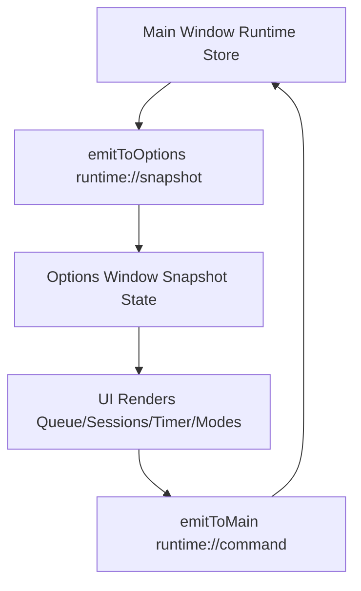
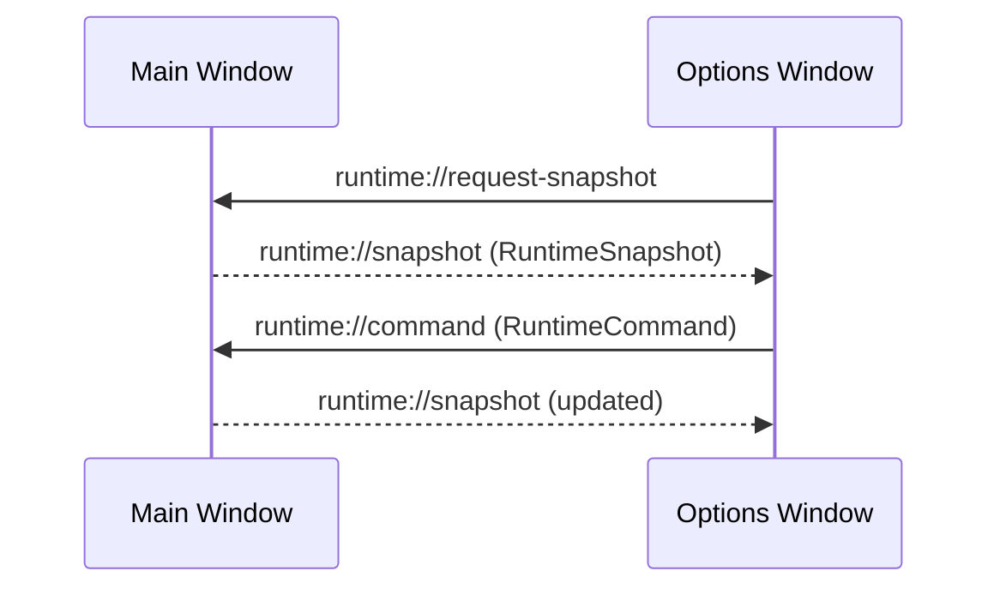
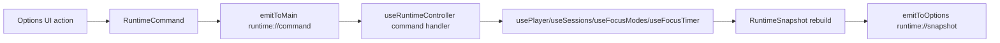

# Runtime State Architecture

## Ownership Rules

Single runtime source of truth: **main window runtime stack**:
- `PlayerView` for UI composition
- `usePlayer` / `useSessions` / `useFocusModes` / `useFocusTimer` for domain state
- `useRuntimeController` for runtime orchestration + IPC wiring

Main runtime owns:
- queue
- current track
- playback state
- current index
- shuffle state
- repeat state
- volume
- mute state
- active session
- active focus mode
- focus timer state

Options window role:
- requests runtime snapshots
- subscribes to runtime snapshot updates
- emits typed runtime commands/intents
- does not own independent runtime playback/session/mode/timer state

Persisted configuration (still local-storage driven):
- `useAppSettings` (playback settings, import/export/reset)

## Runtime Model

Files:
- `src/runtime/RuntimeSnapshot.ts`
- `src/runtime/RuntimeState.ts`
- `src/runtime/RuntimeEvents.ts`
- `src/runtime/useRuntimeController.ts`

Typed IPC:
- `src/ipc/events.ts`
- `src/ipc/player.contract.ts`

## Synchronization Flow

## Event Flow

## Command Flow

## Runtime vs Persisted Configuration Audit

### `useSessions`
- Runtime-sensitive:
  - active session selection / session start effect on current queue/playback
- Persisted:
  - sessions list data in localStorage
- Architecture outcome:
  - main window owns runtime application of sessions; options emits session commands only

### `useFocusTimer`
- Runtime-sensitive:
  - phase transitions, countdown, playback interactions
- Persisted:
  - timer config values
- Architecture outcome:
  - timer runtime is owned by main window; options sends timer commands

### `useFocusModes`
- Runtime-sensitive:
  - active mode selection and runtime side effects (volume/session load)
- Persisted:
  - mode definitions and selected mode id persistence
- Architecture outcome:
  - active mode runtime is owned by main window; options sends mode commands

### `useAppSettings`
- Runtime-sensitive:
  - feeds initial player behavior config
- Persisted:
  - settings store, import/export/reset
- Architecture outcome:
  - kept as persisted configuration hook; options may still manage config forms

## Migration Notes

1. Added runtime snapshot/event model (`runtime://request-snapshot`, `runtime://snapshot`, `runtime://command`).
2. Main window now publishes full runtime snapshots.
3. Options window no longer instantiates runtime playback/session/mode/timer hooks.
4. Options window controls runtime exclusively via typed commands.
5. Legacy `player://...` events are still supported in main for backward compatibility during migration.
6. Runtime command switch + snapshot publishing moved from `PlayerView.tsx` into `useRuntimeController.ts`.

## Runtime Controller Responsibility

`useRuntimeController` now owns:
- subscribing to `runtime://command`
- handling all `RuntimeCommand` variants
- responding to `runtime://request-snapshot`
- emitting `runtime://snapshot` updates
- maintaining temporary legacy compatibility (`player://...` listeners + `player://state` response)

Why `PlayerView` is no longer the command hub:
- keeps component focused on rendering and local UI interactions
- centralizes orchestration and IPC lifecycle into one runtime module
- reduces cognitive load and makes future command migrations safer

## Current Migration Status

- Runtime command architecture: **active**
- Options window runtime control path: **runtime://command**
- Legacy path: **still enabled** (`player://...`) for compatibility
- Rust backend changes: **none** (as intended)

## Legacy Retirement Plan (`player://...`)

1. Keep both runtime and legacy listeners during transition.
2. Confirm no callers remain on raw `player://...` control path.
3. Remove legacy listeners from `useRuntimeController`.
4. Remove `player://state` compatibility snapshot emission.
5. Keep runtime events as sole sync/control protocol.

## Remaining Risks

- `useAppSettings` remains mounted in both windows; config writes are synced via localStorage, but this is still dual-hook persistence ownership.
- `shuffle` and `repeat` are modeled in runtime snapshot but currently not user-driven in UI.
- Runtime command handler is centralized in `useRuntimeController`; as commands grow, split into smaller command-domain handlers.
- Backward-compatible legacy `player://...` listeners should be removed once all callers migrate to runtime commands.
