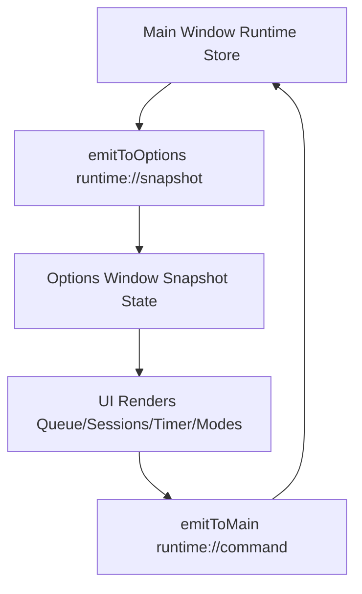
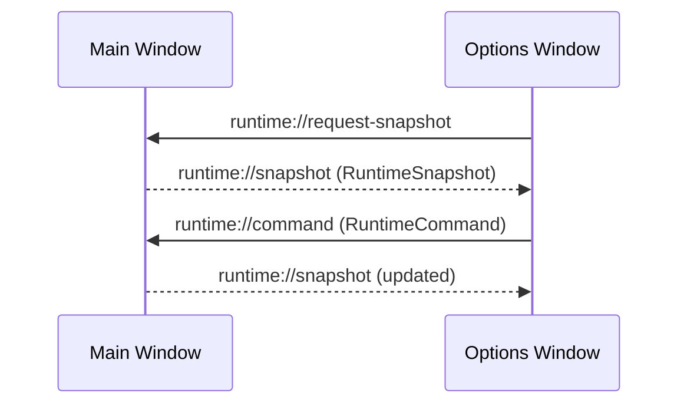
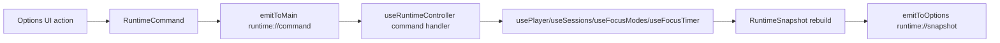

# Runtime State Architecture

## Ownership Rules

Single runtime source of truth: **main window runtime stack**:
- `PlayerView` for UI composition
- `usePlayer` / `useSessions` / `useFocusModes` / `useFocusTimer` for domain state
- `useRuntimeController` for runtime orchestration + IPC wiring

Main runtime owns:
- queue
- current track
- playback state
- current index
- shuffle state
- repeat state
- volume
- mute state
- active session
- active focus mode
- focus timer state

Options window role:
- requests runtime snapshots
- subscribes to runtime snapshot updates
- emits typed runtime commands/intents
- does not own independent runtime playback/session/mode/timer state

Persisted configuration (still local-storage driven):
- `useAppSettings` is now authoritative in **main window only** for runtime-linked settings mutations.
- Options window consumes settings via runtime snapshot and sends typed settings commands.

## Runtime Model

Files:
- `src/runtime/RuntimeSnapshot.ts`
- `src/runtime/RuntimeState.ts`
- `src/runtime/RuntimeEvents.ts`
- `src/runtime/useRuntimeController.ts`

Typed IPC:
- `src/ipc/events.ts`
- `src/ipc/player.contract.ts`

Player runtime decomposition:
- `src/features/player/usePlayer.ts` (orchestration/composition)
- `src/features/player/usePlayerPersistence.ts` (localStorage init + persistence effects)
- `src/features/player/useBlacklist.ts` (blacklist decision helper)
- `src/features/player/useYouTubePlayer.ts` (YouTube player type/opts/track/title enrichment)
- `src/features/player/usePlayerEvents.ts` (global shortcut subscriptions)

Settings runtime contract additions:
- `runtime://settings-export` event for export payload response
- `RuntimeCommand` settings intents:
  - `settings.update-playback`
  - `settings.import`
  - `settings.reset`
  - `settings.export-request`

## Synchronization Flow

## Event Flow

## Command Flow

## Runtime vs Persisted Configuration Audit

### `useSessions`
- Runtime-sensitive:
  - active session selection / session start effect on current queue/playback
- Persisted:
  - sessions list data in localStorage
- Architecture outcome:
  - main window owns runtime application of sessions; options emits session commands only

### `useFocusTimer`
- Runtime-sensitive:
  - phase transitions, countdown, playback interactions
- Persisted:
  - timer config values
- Architecture outcome:
  - timer runtime is owned by main window; options sends timer commands

### `useFocusModes`
- Runtime-sensitive:
  - active mode selection and runtime side effects (volume/session load)
- Persisted:
  - mode definitions and selected mode id persistence
- Architecture outcome:
  - active mode runtime is owned by main window; options sends mode commands

### `useAppSettings`
- Runtime-sensitive:
  - feeds initial player behavior config
- Persisted:
  - settings store, import/export/reset
- Architecture outcome:
  - `useAppSettings` is single authority in main runtime controller
  - options is now settings view/controller only via snapshot + typed commands

## Settings Ownership Model

- Authoritative writer: main window `useAppSettings` (called from `PlayerView`, orchestrated by `useRuntimeController`)
- Options window:
  - reads `snapshot.settings` and `snapshot.settingsImportError`
  - emits settings commands (`settings.update-playback`, `settings.import`, `settings.reset`, `settings.export-request`)
  - receives export payload through `runtime://settings-export`

Reason dual-writer removal:
- avoids conflicting localStorage writes across windows
- keeps settings mutation side effects centralized with runtime command handling
- aligns settings with existing runtime command/snapshot architecture

## Player Module Decomposition Status

- `usePlayer.ts` remains API-compatible for current callers (`PlayerView`, runtime controller dependencies).
- `usePlayer.ts` is now orchestration-first and composes focused player modules.
- Extracted concerns:
  - persistence setup/effects
  - blacklist helper logic
  - YouTube player utility + queue title enrichment
  - global shortcut event subscriptions

Remaining player debt:
- queue transition and playback transition logic is still concentrated in `usePlayer.ts`.
- If needed, next safe split is queue transition helpers (`remove/next/previous/dedup`).

## Migration Notes

1. Added runtime snapshot/event model (`runtime://request-snapshot`, `runtime://snapshot`, `runtime://command`).
2. Main window now publishes full runtime snapshots.
3. Options window no longer instantiates runtime playback/session/mode/timer hooks.
4. Options window controls runtime exclusively via typed commands.
5. Runtime command switch + snapshot publishing moved from `PlayerView.tsx` into `useRuntimeController.ts`.
6. Settings dual-writer pattern removed: options no longer mutates settings directly through `useAppSettings`.

## Runtime Controller Responsibility

`useRuntimeController` now owns:
- subscribing to `runtime://command`
- handling all `RuntimeCommand` variants
- responding to `runtime://request-snapshot`
- emitting `runtime://snapshot` updates

Why `PlayerView` is no longer the command hub:
- keeps component focused on rendering and local UI interactions
- centralizes orchestration and IPC lifecycle into one runtime module
- reduces cognitive load and makes future command migrations safer

## Current Migration Status

- Runtime command architecture: **active**
- Options window runtime control path: **runtime://command**
- Legacy path: **retired in source**
- Rust backend changes: **none** (as intended)

## Legacy `player://...` Audit Result

Classification and outcome:

- `player://state`: safe to remove -> removed
- `player://request-state`: safe to remove -> removed
- `player://play-index`: safe to remove -> removed
- `player://remove-track`: safe to remove -> removed
- `player://clear-queue`: safe to remove -> removed
- `player://dedup-queue`: safe to remove -> removed
- `player://start-session`: safe to remove -> removed

Current status:
- Active producers in `src/`: none
- Active consumers in `src/`: none
- Retained for compatibility: none

Current IPC model after cleanup:
- Runtime control/sync:
  - `runtime://request-snapshot`
  - `runtime://snapshot`
  - `runtime://command`
  - `runtime://settings-export`
- Shell shortcut events (Rust -> frontend):
  - `global-shortcut://play-pause`
  - `global-shortcut://next-track`
  - `global-shortcut://previous-track`
  - `global-shortcut://toggle-mute`

## Remaining Risks

- `useAppSettings` logic remains reusable and callable in multiple places by design; enforce convention that only runtime controller issues settings mutations.
- `shuffle` and `repeat` are modeled in runtime snapshot but currently not user-driven in UI.
- Runtime command handler is centralized in `useRuntimeController`; as commands grow, split into smaller command-domain handlers.
- Keep runtime command handler modular as event surface grows (queue/session/focus/settings partitions).

## Session Queue-Save Commands

New runtime commands for updating existing sessions from the active runtime queue:
- `session.append-current-queue`
- `session.replace-with-current-queue`
- `session.remove-track`

Flow:
1. Options window emits typed runtime command.
2. Main window `useRuntimeController` dispatches to `useSessions`.
3. Updated sessions are reflected back through `runtime://snapshot`.

Append semantics:
- `session.append-current-queue` performs deterministic unique merge.
- Existing session track order is preserved.
- Only new unique tracks from current queue are appended in queue order.

Duplicate identity rule (priority order):
1. normalized YouTube video id
2. normalized source URL
3. track id fallback

Selected session track management:
- Sessions panel can expand a selected session and inspect saved tracks.
- Individual saved tracks can be removed via `session.remove-track`.
- Removal is row-specific (by `trackId`) to avoid destructive cleanup of legacy duplicates.

Start Session semantics:
- `session.start` is queue replacement, not append.
- Main runtime controller resolves the session from current main state and calls player queue replacement.
- Replacement is idempotent: repeated `Start Session` clicks produce the same queue content as the saved session list (no multiplication).
- Empty sessions replace the queue with empty state (`currentIndex = -1`).

Mutation ownership:
- Options window does not mutate sessions directly.
- Session list remains persisted in localStorage through `useSessions` (main-owned mutation path).

## Blacklist Entry Types And Matching

Playback blacklist now supports typed entries:
- `video`: YouTube link or video id
- `category`: music type/category text
- `genre`: genre text
- `keyword`: free-text keyword

Deterministic matching rules:
- `video`: exact normalized match against track video id/source url (YouTube id normalization first).
- `category` / `genre` / `keyword`: case-insensitive substring match over track metadata fields (`title`, `artist`, `sourceUrl`, `videoId`).

Backward compatibility:
- Existing `blacklistedVideoIds` behavior is preserved.
- New `blacklistEntries` list is additive and evaluated together with legacy exact-id list.
